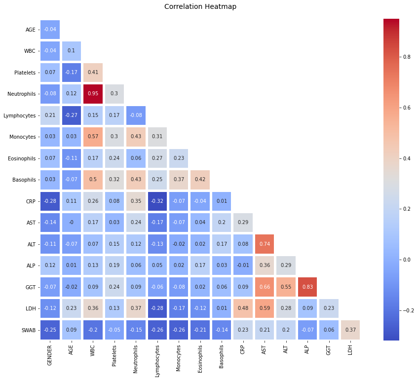
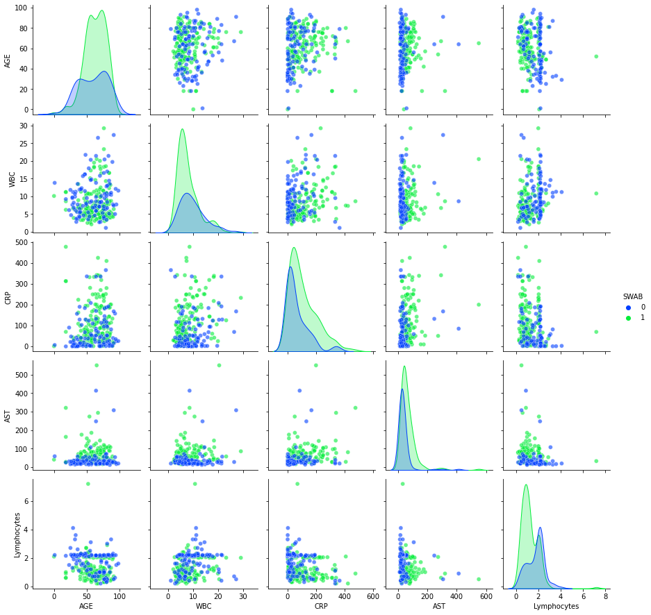

# Exploratory Analysis for COVID-19

Inspired by the papaer of [Brinati et al. (2020)](https://zenodo.org/record/3886927#.X7Jy_ZMzbm1), I produce an exploratory analysis attempting to detect COVID-19 (SWAB) based on features such as gender, age, blood exams, etc. 

## Plots

I plot a heatmap that shows the correlation between the features GENDER, AGE, WBC, Platelets, Neutrophils, Lymphocytes, Monocytes, Eosinophils, Basophils, CRP, AST, ALT, ALP, GGT, LDH and SWAB.


I show a pairplot of "AGE", "WBC", "CRP", "AST" and "Lymphocytes", by visualising SWAB as hue. The two classes are male (0) and female (1).



## Scripts


You can either open the [Notebook](exploratory_analysis_covid-19.ipynb) or run the [script](exploratory_analysis_covid-19.py) as following:

```
python3 exploratory_analysis_covid-19.py
```

## Requirements:

All scripts were developed using Python 3.8.6 on Ubuntu 20.04.1 LTS.

They have been tested with the following package versions:

* numpy == 1.19.4

* matplotlib == 3.3.2

* pandas == 1.1.4

* seaborn == 0.11.0

To install them run in a shell:

```
pip install -r requirements.txt
```

